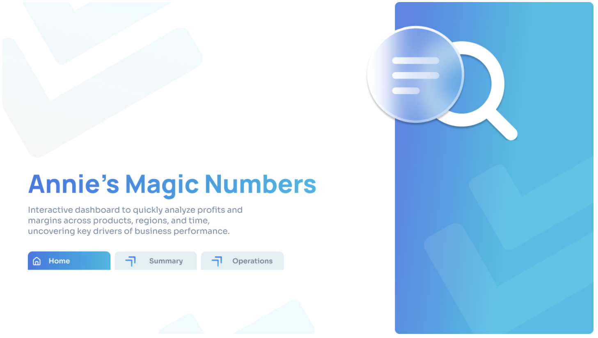
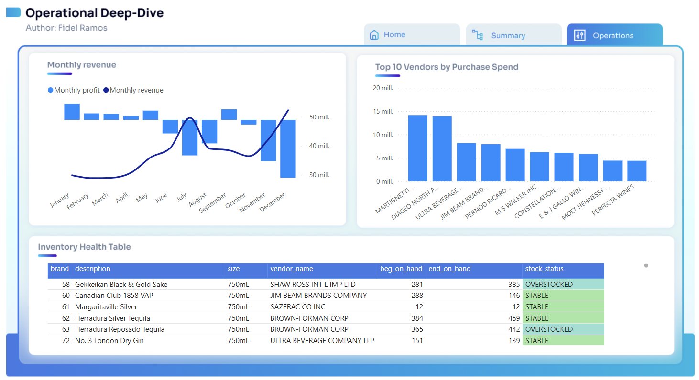
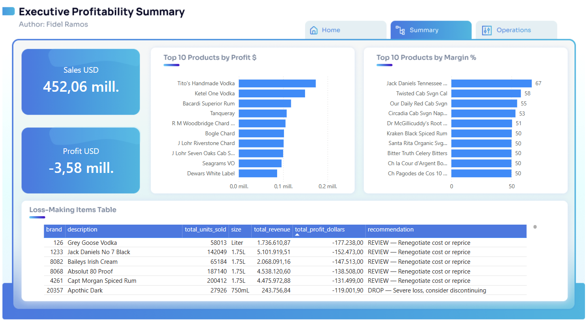
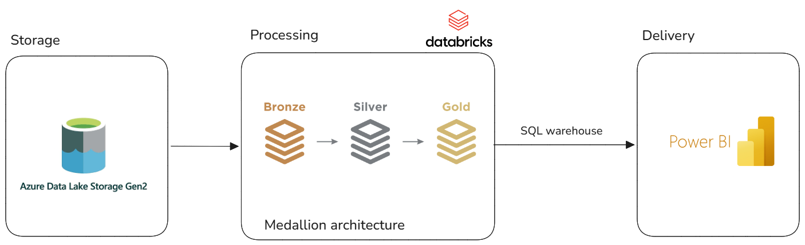

# Annie's Magic Numbers Medallion Architecture

This project implements a robust data engineering solution using a Medallion architecture within **Databricks** powered by **PySpark**. It is designed to transform raw data into actionable insights for strategic decision-making.

## Project Visualization

---

## Live Dashboard
You can interact with the full report here:  
[**View Power BI Dashboard**](https://app.powerbi.com/view?r=eyJrIjoiZGMwODg4OTAtMjRmOS00MjlmLTliNjItYTE3YzU0ZWJjNDdiIiwidCI6IjQwMDE5MDJmLWMxODYtNGQ3OS05ODkzLTc4ZmVkMTFjYmU4ZCIsImMiOjR9)

---

## Architecture Diagram

---

## Technical Description

The project architecture follows the **Medallion** pattern, ensuring data quality and traceability at every stage of the process:

### Data Layers
1.  **Bronze Layer (Ingestion):** 
    *   Ingests raw CSV data from **Azure Data Lake Gen2**.
    *   Persists data in **Delta Lake** format to guarantee ACID transactions and fault tolerance.
2.  **Silver Layer (Cleaning and Refining):** 
    *   Removes duplicates, handles missing values, and standardizes formats.
    *   Performs schema and data type validation to ensure technical consistency.
3.  **Gold Layer (Business Metrics):** 
    *   Calculates critical KPIs such as Profitability, Inventory Turnover, and Profit Margins.
    *   Provides high-level aggregated tables optimized for direct consumption by **Power BI**.

### Processes and Optimization
*   **Engine:** Executed on Databricks clusters using **Spark SQL** and **PySpark**.
*   **Optimization:** Implementation of techniques such as `repartition`, `cache()`, and `optimize` to maximize query performance and minimize processing costs.
*   **Data Governance:** Integration with Unity Catalog for centralized table registration and management.

---

## Author
**Fidel Alberto Ramos**  
*Data Engineer*
